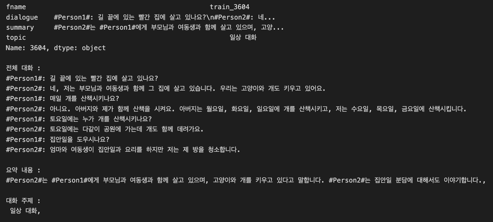
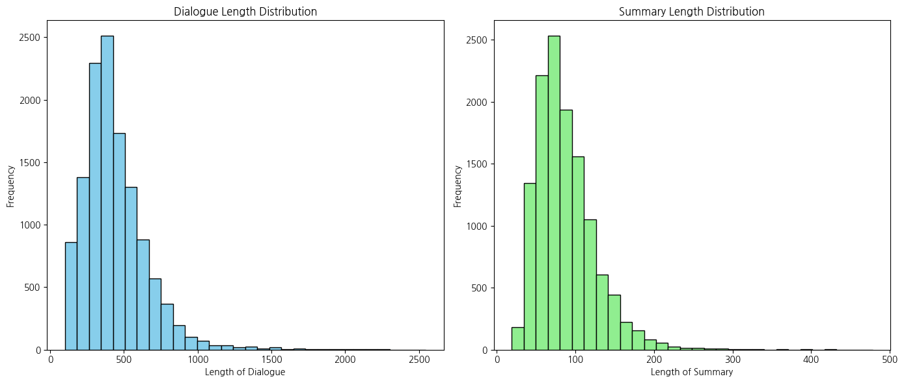
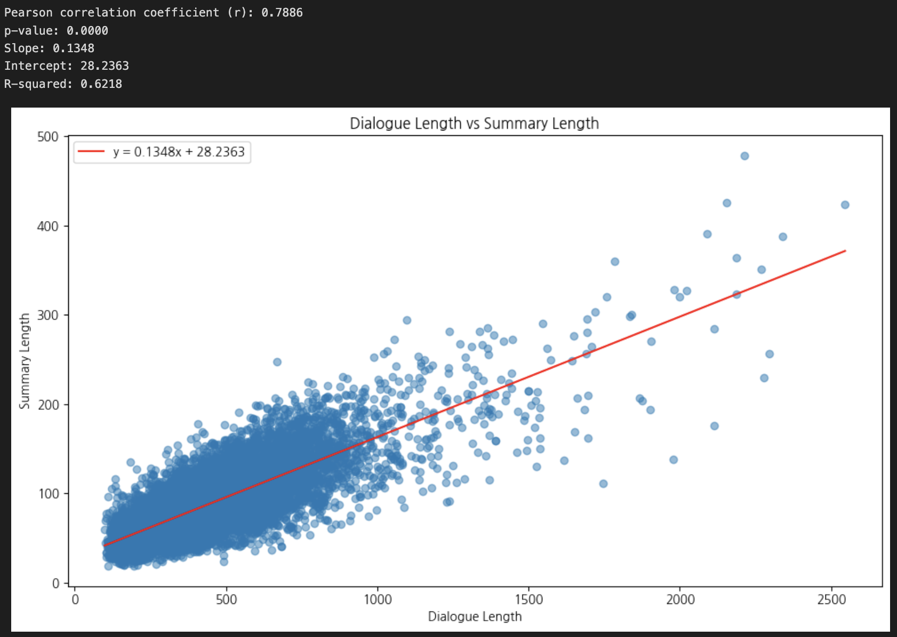
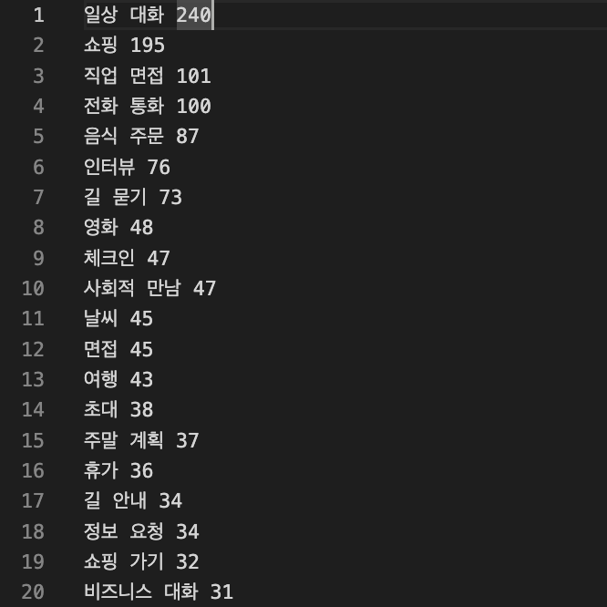
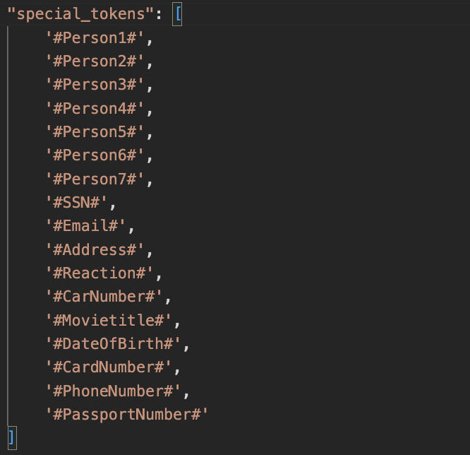
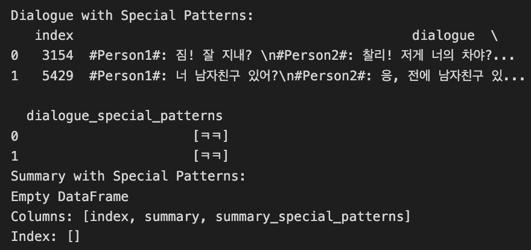
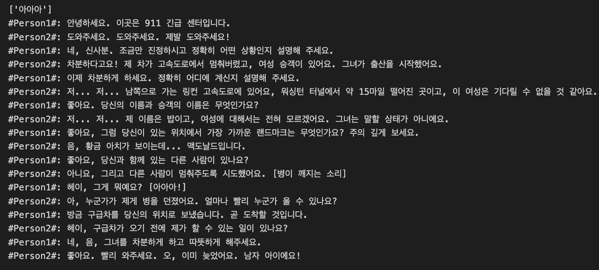
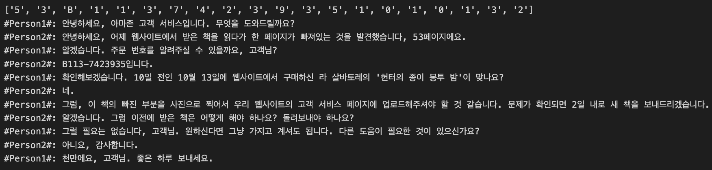
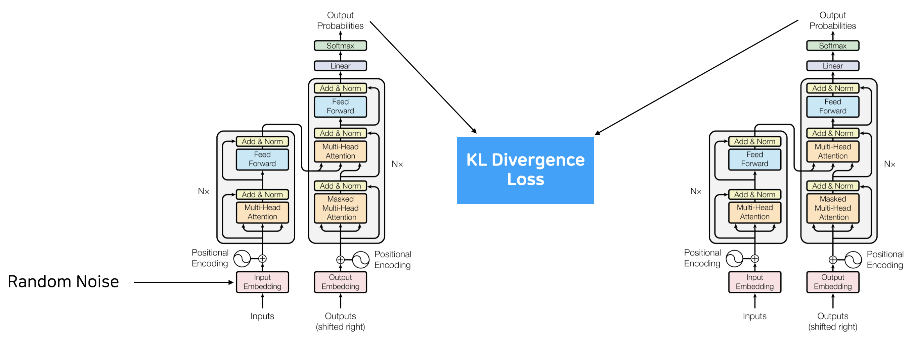
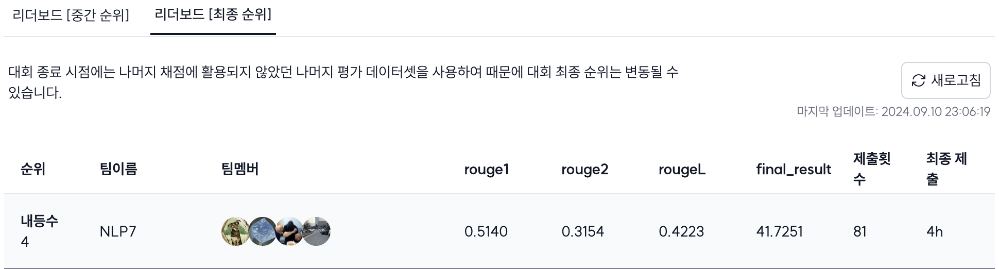

[](https://classroom.github.com/a/zHsKfIy0)

# Title (Please modify the title)
## Team

| | | | | 
| :--------------------------------------------------------------: | :--------------------------------------------------------------: | :--------------------------------------------------------------: | :--------------------------------------------------------------: | 
|            [기현우](https://github.com/UpstageAILab)             |            [조수한](https://github.com/UpstageAILab)             |            [김민준](https://github.com/UpstageAILab)             |            [김홍석](https://github.com/UpstageAILab)             |            
|                         EDA, Modeling                            |                            EDA, Modelin, BackTranslation                            |                            EDA, Modeling, Data Generate, BackTranslation                          |                            EDA, Modeling

## 0.Overview
### Environment
- Upstage에서 제공해주신 서버를 사용했습니다.

    - OS : Ubuntu
    - CPU : AMD Ryzen Threadripper 3970X 32-Core Processor
    - Memory : 252GB
    - GPU : RTX 3090


### Requirements
pip install -r requirements.txt

## 1.Competiton Info

### Overview

본 대회는 여러 명의 화자들이 나눈 대화 내용을 입력으로 받아 요약문을 생성하는 Dialogue Summarization입니다.

### Timeline

- Start Date : 2024.08.29 10:00
- Final submission deadline : 2024.09.10 19:00


## 2.Data descrption

### Dataset overview



- train, dev(valid), test 세 가지 csv 파일이 주어집니다.
- train, dev set에서는 위 이미지에 나와있듯 fname, dialogue, summary, topic 4가지 컬럼으로 구성되며 test는 fname, dialogue로만 구성됩니다.
- 목표는 train, dev에 있는 dialogue를 학습시키고, test dialogue를 입력 받아 정답에 가까운 summary를 구하는 것입니다.

### EDA

#### 1.Dialogue, Summary 길이 파악



요약 모델을 학습하기 전에 대화문과 요약문의 길이에 대해 파악합니다. 이는 모델 학습시 학습에 반영될 문장의 최대 길이, 생성할 문장의 최대 길이를 결정하는데 중요한 역할을 합니다.



또한, 대화문과 요약문 길이간 적절한 비율을 파악하기 위해 선형회귀를 수행했을 때 기울기(slope)가 약 0.14임을 알 수 있습니다. 이를 근거로 dialogue 길이의 0.14 정도로 generate max length를 설정할 수도 있을 것 같습니다.

#### 2.Topic



그래프를 그렸을 때 너무 지저분해져 따로 첨부하지는 않았으나, train과 dev를 취합했을 때 topic은 6337개입니다.

많은 수의 topic은 1개의 row로 구성되어 있기 때문에 특별한 영향력을 갖는다고 해석하기 어렵습니다. 따라서 상위 5개 또는 10개의 topic을 선정해서 샘플 데이터를 선별하는데 사용했습니다.

선별된 샘플 데이터는 이후에 SOLA API를 이용해 데이터를 생성하는데 사용되었습니다.


### Data Processing

#### 1.Special Tokens

dialogue에 등장하는 #문자열# 형태의 특수토큰은 다음과 같습니다.



처음엔 이러한 토큰이 필요하지 않은듯 했으나, 데이터 분석 과정에서 summary에 특수토큰이 등장하는 것을 확인하고 요약문 생성시 주어, 목적어로 활용된다는 점을 감안해 제거하지 않았습니다.

#### 2.반복되는 글자 제거



구어체임에도 불구하고 dialogue 컬럼에는 "ㅋㅋ"와 같은 값들이 존재합니다. 극소량만 존재하지만 이왕 발견한거 제거해줬습니다.



또한 위와 같이 동일한 글자가 연속적으로 등장하는 경우에도 문자열의 길이만 증가시킬 뿐 특별한 의미를 갖지 않는다고 판단하여 최초 한글자만 남겨두고 뒷부분은 제거하는 방식으로 처리했습니다.

#### 3.한글 이외의 글자



한글이 아닌 값이 어떤 것들이 있는지 파악해봤습니다. 

분석 결과

- 대화 중 화자 A가 말하는 동안 화자 B의 대답이나 제스처를 취하는 경우 ```[문자열]``` 또는 ```(문자열)```로 나타나는 경우가 있었습니다. 이는 별도의 턴(turn)으로 분할하기에 애매하고 요약문에 별다른 영향을 주지못한다고 판단해 #Reaction# 토큰으로 대체하였습니다.
- 숫자와 알파벳은 의미를 갖는 단어(주문번호, 날짜, 병명 등)를 나타냈기 때문에 별도로 처리하지 않았습니다.
- 이밖에도 ㅏ, ㅍ, ㄷ와 같은 오타도 존재했는데 문맥에 맞는 글자로 변환하거나 제거하였습니다.


## 4. Modeling

### Model descrition

어떻게 보면 가장 많은 시간을 투자했지만 그만큼의 리턴이 없었던 모델링 파트입니다.

pretrained weight를 온전히 활용할 수 있어야 하기 때문에 전반적으로 모델을 구성하거나 변형을 주는 것은 매우 어려웠기 때문에 특별한 방법론들을 찾아야만 했습니다.

### Modeling Process

#### 1.R3F



- 입력에 일부러 random noise를 더해서 추론시키고 평범하게 추론했을 때와의 KL Divergence를 loss로 함께 사용합니다. 
- cross entropy가 문맥을 반영하지 않고 단어를 중점으로 보기 때문에 꽤나 효과적일 것이라 적용했었는데 아쉽게도 성능은 baseline보다 감소되었습니다.

#### 2.Rogue Loss

- 이번에도 마찬가지로 cross entropy만으로는 한계가 있는 것이라는 생각에 평가 지표인 Rogue Score를 손실함수로써 사용할 수 없을까라는 생각이었습니다.
- cross entropy와 함께 rouge2를 손실값으로 사용했을 때 학습 중 추론 결과는 꽤나 준수해보였으나 리더보드 점수는 baseline보다 낮았고, 조사 결과 미분이 불가능하여 손실함수로는 사용이 불가능함을 알았습니다.

#### 3.Reinforcement Learning

- Rouge Score를 Reward로 설정하여 강화학습을 시도했습니다.
- 하지만 학습을 통한 수렴 자체가 굉장히 어려웠고 1epoch에 소모되는 시간이 굉장히 컸기 때문에 기각했습니다.

#### 4.Tokenizer, Pretraining

- 대회 데이터에 토크나이저와 pretrained model간 부적합한 부분이 있어 점수에 한계가 있는 것은 아닐까라는 생각에 토크나이저를 새로 구성하고 추가적인 pretraining을 해봤습니다.
- BART : SentencePiece, T5 : BPE
- Pretrain Task : Span Corruption
- 토크나이저와 pretrained weight가 서로 상응하지 않는 경우 pretrained weight를 사용하기 어렵다는 점을 알게되어 더 이상 시도하지 않았습니다.

#### 5.문제점과 중간결론

- BART, T5를 기반으로 몇가지 실험을 진행하였지만 리더보드 점수는 최대 42점이었고 대부분 40점보다 낮은 결과를 보였습니다.
- 한국어로 학습된 pretrained weight는 선택 폭이 너무 좁았습니다.
- 대회 데이터는 원래 영어로 구성된 데이터였으나 한국어로 번역된 것이기 때문에 형태소 분석시 적합한 결과라고 받아들이기 힘든 경우가 있었습니다. ex) '스미스' -> ['스', '미스']
- 따라서 한국어 데이터를 ChatGPT, SoLA를 이용해 영어 데이터로 번역하였습니다.

#### 6.LLama3 LoRA

BART, T5 모델들은 성능 향상이 이루어지지 않아서 LLM 모델을 시도해봤습니다. LLama3-8B를 모델로 선정했는데 전체 모델을 fine tuning하기엔 컴퓨팅 자원이 부족해 LoRA를 적용해 소량의 파라미터만 학습시켰고, 성능이 개선되었습니다.

#### 7.Back Translation, Data Generation

멘토링 시간에 train와 test의 어체가 다르다는 점을 학습에 반영할 수 있으면 좋을 것이라는 피드백에 따라

- 영어 데이터를 한국어로 번역할 때 구어체, 번역체, 문어체로 다양하게 생성.
- 기존 한국어 데이터셋에서 topic을 기준으로 top5를 추려내고, 샘플링으로 데이터를 선별해서 fewshot으로 제공합니다.

이러한 방법을 통해 데이터를 생성하여 학습에 반영했었는데, 시간이 부족한 관계로 학습을 길게 하지못해 성능 개선으로 연결되지 못했습니다.

## 5. Result

### Leader Board




### Presentation

- _Insert your presentaion file(pdf) link_