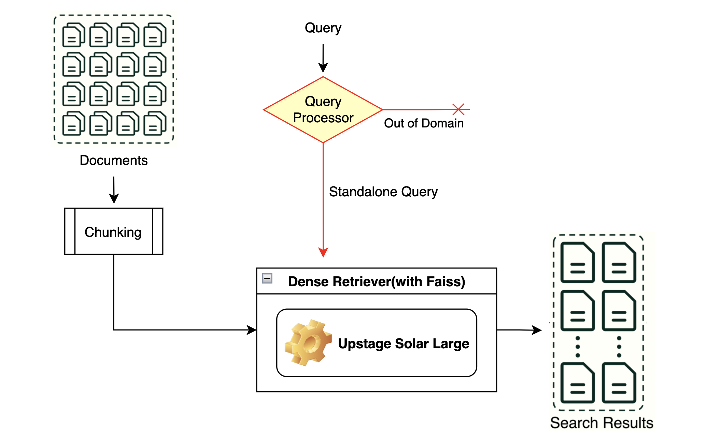

## 0. Overview

PPT : [패스트캠퍼스_Upstage_AI_Lab_3기_IR_경진대회_발표자료_8조.pdf](./ppt/패스트캠퍼스_Upstage_AI_Lab_3기_IR_경진대회_발표자료_8조.pdf)  
Blog : [https://pervin0527.github.io/competition/Information-Retrieval/](https://pervin0527.github.io/competition/Information-Retrieval/)


### Environment
- AMD Ryzen Threadripper 3960X 24-Core Processor
- NVIDIA GeForce RTX 3090
- CUDA Version 12.2
- OS: Ubuntu 20.04
- IDE: Jupyter Notebook, VSCode

### Requirements

    pip install -r requirements.txt

## 1. Competiton Info

### Overview

입력된 쿼리와 관련성이 높은 문서들을 얼마나 잘 검색하는가를 평가하는 대회.

### Timeline

- Start Date : 2024.10.02
- End Date : 2024.10.24

## 2. Components

### Directory

```
├── ppt
├── dataset
├── notebooks # 실험용 ipynb 파일들
├── legacy # version1
├── src # latest version for RAG
│    ├── data
│    ├── chunking
│    ├── retriver
│    ├── search
│    ├── utils
│    ├── config.yaml
│    └── main.py
│
├── gitignore
├── keys.env
├── README.md
└── requirements.txt
```

## 3. Data descrption

### Dataset overview

- ```eval.jsonl``` : 쿼리 데이터셋. 단일 문장인 질의도 있고, 멀티턴 형식의 질의도 존재한다.

    ```
    {"eval_id": 78, "msg": [{"role": "user", "content": "나무의 분류에 대해 조사해 보기 위한 방법은?"}]}
    {"eval_id": 213, "msg": [{"role": "user", "content": "각 나라에서의 공교육 지출 현황에 대해 알려줘."}]}
    {"eval_id": 107, "msg": [{"role": "user", "content": "기억 상실증 걸리면 너무 무섭겠다."}, {"role": "assistant", "content": "네 맞습니다."}, {"role": "user", "content": "어떤 원인 때문에 발생하는지 궁금해."}]}
    {"eval_id": 81, "msg": [{"role": "user", "content": "통학 버스의 가치에 대해 말해줘."}]}
    {"eval_id": 280, "msg": [{"role": "user", "content": "Dmitri Ivanovsky가 누구야?"}]}
    {"eval_id": 10, "msg": [{"role": "user", "content": "피임을 하기 위한 방법중 약으로 처리하는 방법은 쓸만한가?"}]}
    ```

- ```documents.jsonl``` : 문서 데이터셋.

    ```
    ## 일부 내용 생략
    {"docid": "42508ee0-c543-4338-878e-d98c6babee66", "src": "ko_mmlu__nutrition__test", "content": "건강한 사람이 에너지 균형을 평형 상태로 유지하는 것은 중요합니다. 에너지 균형은 에너지 섭취와 에너지 소비의 수학적 동등성을 의미합니다. 일반적으로 건강한 사람은 1-2주의 기간 동안 에너지 균형을 달성합니다."}
    {"docid": "4a437e7f-16c1-4c62-96b9-f173d44f4339", "src": "ko_mmlu__conceptual_physics__test", "content": "수소, 산소, 질소 가스의 혼합물에서 평균 속도가 가장 빠른 분자는 수소입니다."}
    {"docid": "d3c68be5-9cb1-4d6e-ba18-5f81cf89affb", "src": "ko_ai2_arc__ARC_Challenge__test", "content": "종이와 플라스틱은 재활용 가능한 자원입니다. "}
    ```

### EDA

문서별 글자단위로 길이 분석.

- 최소 길이: 44
- 최대 길이: 1230
- 평균 길이: 315
- 중앙값 길이: 299

문서의 길이를 분석했을 때 최대 길이가 300이므로 chunking이 필수적으로 적용되어야할지 실험이 필요하다.

```python
{"eval_id": 107, "msg": [{"role": "user", "content": "기억 상실증 걸리면 너무 무섭겠다."}, {"role": "assistant", "content": "네 맞습니다."}, {"role": "user", "content": "어떤 원인 때문에 발생하는지 궁금해."}]}

{"eval_id": 276, "msg": [{"role": "user", "content": "요새 너무 힘들다."}]}
```

쿼리 데이터셋에는 멀티턴 대화인 데이터가 20개, 과학적 질의가 아닌 일상대화가 20개 존재한다.

### Data Processing

- 입력된 쿼리가 멀티턴 대화라면 단일 질의로 변환.
- 과학적 상식을 묻는 질의인 경우 검색엔진에 입력하고, 그렇지 않은 경우에는 "답변을 생성할 수 없다"를 반환.

## 4. Modeling

### Modeling Process

**Version 1**



- 적절한 Chunking size를 parameter search로 탐색.(임베딩 모델 탐색과 병행 수행.)
- Dense 검색기에 적용될 한국어 임베딩 모델을 찾기 위한 실험. -> 어떤 모델이 (한국어)임베딩을 잘할까?
  
  - 데이터셋에는 label이 없다. 즉, 모델의 성능을 측정하려면 리더보드 점수 밖에 없다.
  - 대략적인 성능이라도 파악해보자.
    1. 문서마다 10개의 질문을 LLM(gpt-4o)이 생성.
    2. 문서의 내용과 적절한 관련성을 갖는 질의임을 최소한으로 보장 받기 위해 GEval 3점 이상인 질의를 최대 3개 사용.생성된 질문은 문서와 동일한 docid를 포함.
    3. 대회 평가 지표와 동일한 방식(MAP)으로 검색 결과를 평가.


Sparse(BM25) 보다 Dense의 리더보드 점수가 더 높았다.


**Version 2**


version1에서는 의미적으로 유사하여 잘못된 문서가 높은 유사도를 갖는 문제가 있다.


- 이러한 문제를 해결하기 위해 BM25 + Upstage Solar를 결합한 Hybrid 검색기를 도입.
- Query Ensemble을 활용하여 검색 정확도 성능을 향상.
- ReRanker도 적용해봤으나 점수 향상으로 이어지지는 못했다.


## 5. Result

### Leader Board


### Presentation

- [ppt/패스트캠퍼스_Upstage_AI_Lab_3기_IR_경진대회_발표자료_8조.pdf](./ppt/패스트캠퍼스_Upstage_AI_Lab_3기_IR_경진대회_발표자료_8조.pdf)

### Reference

- Langchain https://python.langchain.com/docs/versions/v0_3/ 
- Contextual Retrieval, Ensemble Retriever https://www.anthropic.com/news/contextual-retrieval 
- Query Ensemble https://www.kaggle.com/competitions/kaggle-llm-science-exam/discussion/446358
- Convex Combination 
    - paper https://arxiv.org/pdf/2210.11934 
    - Code https://github.com/Marker-Inc-Korea/AutoRAG/blob/main/autorag/nodes/retrieval/hybrid_cc.py 


